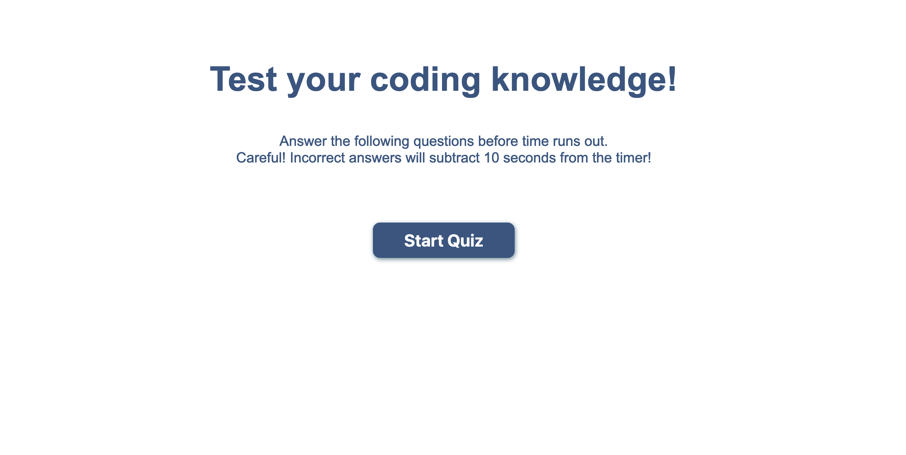
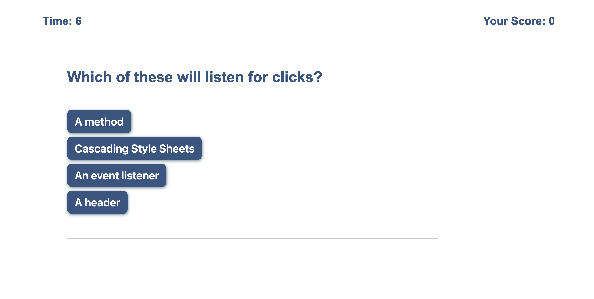

# Code-Quiz
A timed multiple choice coding quiz

 

## Here's what I did:

1. Created repository, all required files, and committed same
2. Wrote initial html and CSS
3. Added timer functionality
4. Added created event listener for start button
5. Created objects for 3 questions and an array that contains them
6. Created a function that appends and displays the question and it's array of answer choices when the start button is pressed
7. Added functionality for increasing score and clearing question
8. Added functionality for hiding the start button area when the start button is pressed.
9. Added high score box and styled same (poorly, admittedly)
10. Created save functionality for scores
11. Added play-again functionality
12. Made saved scores save and print from local storage.
13. Created Clear high scores function
14. Added correct/incorrect feedback
15. Added a few more questions
16. Made the timer decrement time when use picks wrong answer

 

### Link to live site:
 

https://cheloe.github.io/Code-Quiz/

 

### Link to GitHub Repository:
 

https://github.com/Cheloe/Code-Quiz

  

### Screenshots:

 

